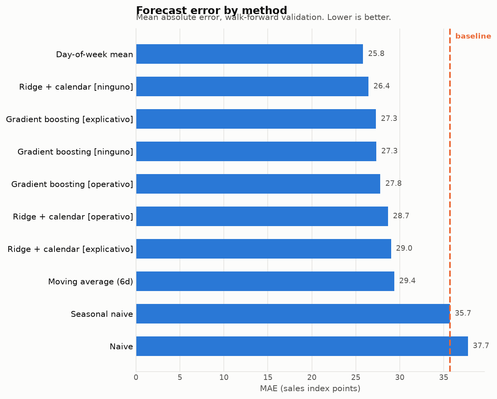
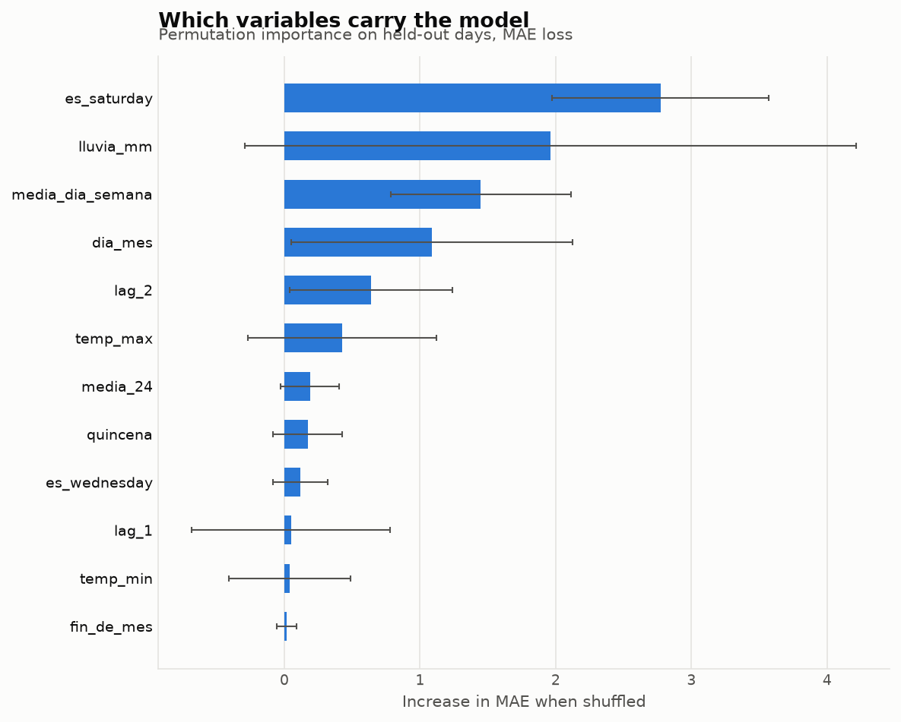
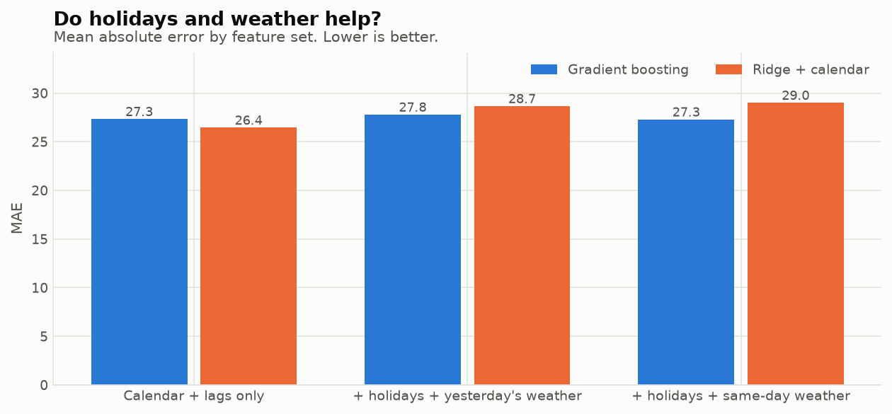
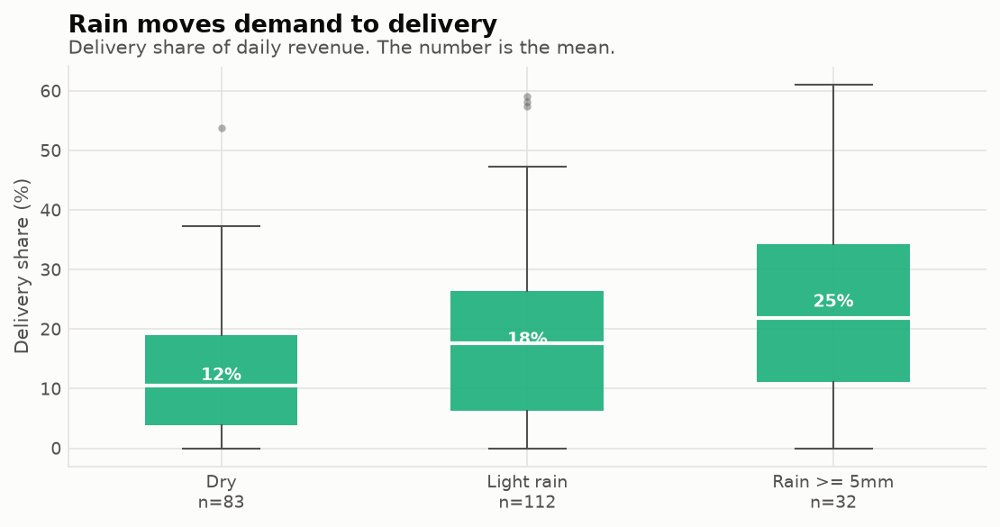
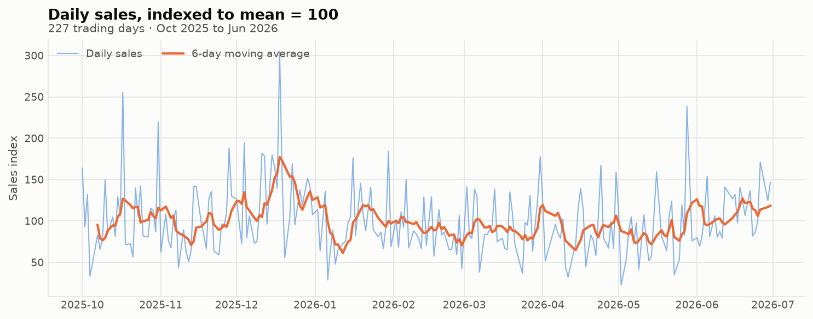
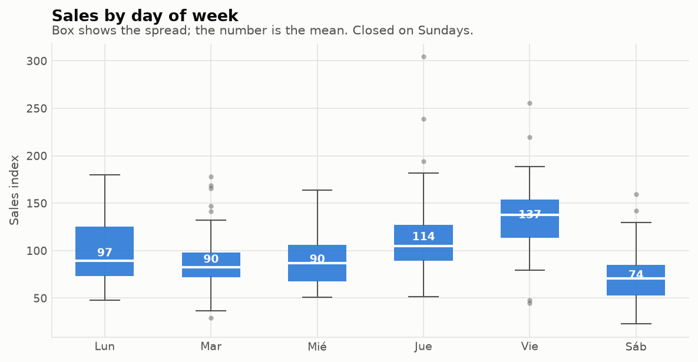
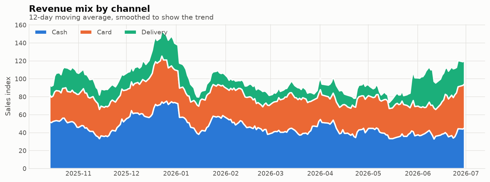
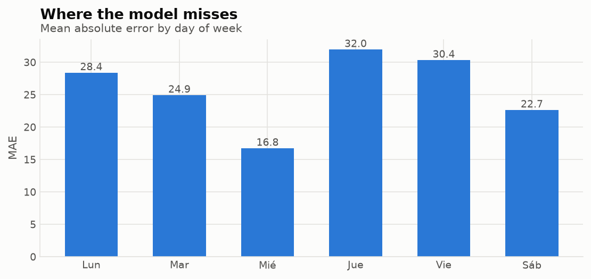
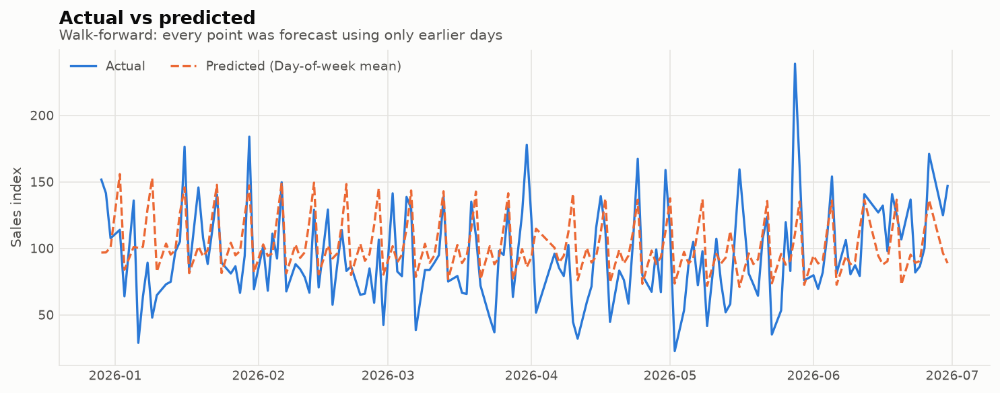

# Restaurant Sales Forecasting


**Forecasting daily sales for a small restaurant, using 227 days of its real operating data, a public holiday calendar, and daily weather history.**

A restaurant buys perishable stock against a guess. Guess high and it rots, guess low and it turns customers away. The question is narrow and practical: **how much better than "the same as last week" can we do, and is a machine learning model worth the complexity?**

Three findings came out, and two of them are negative. They are reported anyway, because that is the point.

---

## 🎯 Finding 1: the simplest method wins

| Method | MAE | RMSE | MAPE | vs. baseline |
|---|---:|---:|---:|---:|
| 🥇 **Day-of-week mean** | **25.83** | 33.44 | 34.8% | **+27.6%** |
| 🥈 Ridge + calendar | 26.44 | 34.85 | **33.3%** | +25.9% |
| 🥉 Gradient boosting | 27.33 | 36.77 | 34.9% | +23.4% |
| Moving average (6d) | 29.37 | 37.64 | 37.1% | +17.7% |
| *Seasonal naive (baseline)* | 35.69 | 45.69 | 43.9% | 0% |
| Naive (yesterday) | 37.74 | 47.50 | 47.2% | -5.7% |



**The caveat matters more than the ranking.** The winner's 95% bootstrap CI for MAE is **[22.62, 29.28]**, and both models sit inside it. **The top three are statistically tied.** Declaring a winner from 152 forecasts would be reading noise.

So the defensible conclusion is not "day-of-week average is best". It is:

1. Every method **comfortably beats** the heuristic a manager would use by hand, by 18 to 28 percent.
2. **Nothing beats a weekday average by enough to justify its complexity.** Shipping a gradient boosting model here would add a training pipeline, a serving dependency and maintenance to buy a difference the data cannot resolve.

Permutation importance shows why: the model spent its features rediscovering *what day is it, and how has business been lately*, which is exactly what the simple average already encodes.



---

## 🌧️ Finding 2: weather and holidays do not improve the forecast

The obvious next move is to add external drivers. So both were added: **El Salvador's public holiday calendar** (via the `holidays` package) and **daily weather for San Salvador** (Open-Meteo reanalysis: rainfall, rain hours, max and min temperature).

They made the models **worse**.



| Feature set | Ridge | Gradient boosting |
|---|---:|---:|
| Calendar + lags only | **26.44** | 27.33 |
| + holidays + yesterday's weather | 28.66 | 27.79 |
| + holidays + same-day weather | 29.00 | **27.29** |

Ridge degraded clearly, gradient boosting stayed flat. Ten extra columns of mostly-noise cost variance and bought nothing.

**Why the holidays could never have worked:** only **3 public holidays fall on a day the business opened.** A binary indicator with three positive cases out of 227 cannot support an estimate, and any coefficient fitted on it would be noise wearing the costume of a finding.

What holidays *do* predict is **closure**. Of the 7 weekdays with no sales record, **4 are public holidays** (Christmas, New Year, Good Friday, Holy Saturday). That is a real result, just a different one from the one being looked for.

### The honest split that most projects skip

Tomorrow's weather is **not available today**. What exists is a forecast, with its own error. So the weather features were evaluated twice:

| Mode | Uses | Answers |
|---|---|---|
| **Operational** | yesterday's observed weather | what could genuinely run in production |
| **Explanatory** | today's observed weather | the ceiling: how much could a perfect forecast buy? |

Neither helped. The explanatory mode is the upper bound, so **no weather forecast, however good, would have rescued this**. Reporting only the explanatory number and calling it prediction is the classic version of this mistake, and six tests exist specifically to keep the operational mode from seeing its own day.

---

## 💡 Finding 3: rain does not remove demand, it relocates it

This is the one worth acting on.

Rainfall barely correlates with total sales (**r = +0.057**). But against the **delivery share** of revenue, r = **+0.182**, and the picture is unambiguous:



| | Dry (n=83) | Rain ≥ 5mm (n=32) | Change | p |
|---|---:|---:|---:|---:|
| Total sales | 93.3 | 116.2 | +24.6% | 0.047 |
| Delivery revenue | 11.4 | 29.4 | **+158%** | |
| **Delivery share** | **12.2%** | **24.5%** | **+101%** | **0.001** |
| Net of commissions | 89.3 | 107.2 | +20.1% | |
| **Margin** | **95.7%** | **92.4%** | **-3.25 pp** | **0.0009** |

Customers who would have walked in order delivery instead. The totals compensate, which is precisely **why weather cannot help forecast the total**: the signal is in the composition, not the level.

And the composition costs money. The delivery marketplace charges **24% commission plus 13% VAT on that commission**, an effective 27.1% (rates documented publicly in [RestoPos](https://github.com/raulben6/restopos), the POS this business runs). So a rainy day converts the same revenue into **3.25 percentage points less margin**, and that difference is strongly significant.

**What a manager can do with this:** on a rainy forecast, staff the kitchen for delivery throughput rather than counter service, make sure packaging stock is there, and expect the day to be worth less than the till suggests.

> ⚠️ **Read the total-sales row with care.** The +24.6% is only marginally significant (p = 0.047) and is confounded: rainy days cluster in the wet season and are not evenly spread across weekdays. The **compositional** result is the robust one, because a share is far less sensitive to level confounds than a mean is.

---

## 🍗 Product-level demand: the pipeline is built, the data is not there yet

Forecasting the daily total tells the owner what the till will hold. It does not
say **what to buy**. That needs demand per product, which lives in the POS.

The business runs [RestoPos](https://github.com/raulben6/restopos), so I went and
looked. **The POS has no sales history.** On 2026-09-01 the production database held:

| | |
|---|---:|
| Orders | **5**, all on a single day |
| Line items | 7, across 6 products |
| Combos configured | **24** (22 active) |

The menu is fully set up. The transactions are not being captured. The business
records daily totals in a spreadsheet, which is the 227-day series this whole
project is built on, and individual sales never reach the system.

So the per-product analysis **cannot be run**, and no substitute was invented for it.
What exists instead is the machinery, ready and tested:

| Piece | State |
|---|---|
| `scripts/exportar_pos.py` | **Validated against the live production schema.** Read-only, aggregates product × day inside the database, indexes the amounts. |
| `src/productos.py` | ABC analysis, per-product weekday profiles, channel mix, per-product series construction. |
| `scripts/analisis_producto.py` | Runs the descriptives always; **refuses to emit forecast metrics** below the data threshold. |
| `tests/test_productos.py` | 10 tests over a synthetic dataset, covering the logic that has to be right when real data lands. |

### The gate, and why it exists

```python
DIAS_MINIMOS = 60
OBSERVACIONES_MINIMAS_POR_PRODUCTO = 30
```

Splitting a series by product multiplies the number of series and divides the
sample behind each one. Fitting a model on a handful of observations per product
produces numbers that look like results without being results, which is exactly
the trap the holiday indicator would have been with its three positive cases.

So `comprobar_suficiencia()` is a **gate, not a warning**. Descriptives print at any
volume. Forecast metrics do not print until there is history to justify them.

### Safety of the exporter

It touches a live business database, so the constraints are explicit and checkable
in the source: a **single `SELECT`**, a session opened `read_only`, aggregation done
in the database rather than by pulling rows, and **no access to `users`,
`operator_id`, customer notes, cancellation reasons or individual payment methods**.
Amounts are indexed before they are written, exactly as the daily series is.

```bash
railway run --service Postgres python scripts/exportar_pos.py
python scripts/analisis_producto.py
```

`data/ventas_producto.example.csv` documents the output schema.

---

## 📈 What the data looks like



227 trading days, October 2025 to June 2026. The business is **closed on Sundays**, so the series runs on a six-day week and every lag is measured in openings, not calendar days. "A week ago" is six rows back, which keeps weekday alignment intact.

The series is genuinely noisy: **coefficient of variation 41%**, ranging from 23 to 304 around a mean of 100.



| Day | Mean | Std |
|---|---:|---:|
| Monday | 97.1 | 31.5 |
| Tuesday | 90.4 | 33.7 |
| Wednesday | 90.4 | 25.8 |
| Thursday | 114.1 | 50.2 |
| **Friday** | **137.2** | 41.2 |
| Saturday | 73.7 | 31.2 |

**Friday is the peak and Saturday the trough.** That inverts the usual restaurant pattern and says something concrete: this business lives on weekday trade, not weekend leisure. Saturday sells barely half of Friday.



Cash 47%, card 35%, delivery 18%.

### Where the error lives



Error concentrates on **Thursday (MAE 32.0) and Friday (30.4)**, the two highest-volume days, which are also the days a purchasing mistake costs the most. Wednesday, the most predictable, is almost twice as accurate.



---

## 🧪 Method, and the mistake it avoids

**Validation is walk-forward (rolling origin), never a random split.**

A random `train_test_split` scatters future days into training and past days into test, so the model forecasts Tuesday having already seen Thursday. The reported error looks superb and the model is worthless.

Here, every one of the 152 forecasts uses **only data from days strictly before it**, and the models retrain at each step on the expanding window. That claim is not left to trust:

```bash
python -m pytest tests/ -q     # 25 passed
```

| Test | What it proves |
|---|---|
| `test_retardo_1_es_el_valor_anterior` | lag features point backwards, exactly one row |
| `test_retardo_semanal_apunta_a_la_semana_anterior` | the 6-row lag lands on the same weekday |
| `test_medias_moviles_no_incluyen_el_dia_actual` | rolling windows close at t-1 |
| `test_media_dia_semana_solo_mira_atras` | the expanding weekday mean excludes the current row |
| `test_ninguna_variable_correlaciona_perfecto_con_el_objetivo` | no feature is a copy of the target |
| `test_walk_forward_nunca_entrega_el_futuro` | the history handed to every method ends before the target date |
| `test_modo_operativo_usa_el_clima_de_ayer` | operational weather is shifted exactly one opening |
| `test_modo_operativo_no_expone_el_clima_del_dia` | same-day weather columns are absent from the operational set |
| `test_modo_explicativo_si_expone_el_clima_del_dia` | the explanatory mode is deliberate and labelled |

---

## ⚠️ Limitations, stated plainly

- **227 observations is a small sample.** Every metric carries a wide interval, which is why the MAE is reported with a bootstrap CI rather than a single number.
- **A 35% MAPE is high.** Useful for directional purchasing, not for precise cash planning.
- **The holiday effect is unestimable here**, not absent. Three open holidays is not a sample.
- **Drivers still missing**: local and municipal festivities, promotions, competitor activity, menu changes, and payday timing beyond the crude fortnight flag.
- **One establishment, nine months.** Nothing here generalises to restaurants in general.

## 🔭 What would actually improve it

1. **Get the POS actually capturing sales.** The pipeline for this is already written and validated; it is waiting on transaction history, not on code. Two months of real orders opens the whole product-level analysis.
2. **Forecast the channel split, not just the total.** Finding 3 says that is where the weather signal lives, and it is also where the margin lives.
3. **Quantile forecasts instead of a point estimate.** For stock decisions the 80th percentile of demand is more useful than the mean.
4. **More history.** Two full years would let the holiday question be asked properly.

---

## 📁 Running it

```bash
git clone https://github.com/raulben6/wings-forecast.git
cd wings-forecast

python -m venv venv
source venv/bin/activate          # Windows: venv\Scripts\activate
pip install -r requirements.txt

python scripts/run_analysis.py    # figures + reports/resultados.md
python -m pytest tests/ -q        # 25 tests
```

The weather history is cached in `data/clima_diario.csv`, so the analysis reproduces offline. To refresh it:

```bash
python scripts/descargar_clima.py --desde 2025-10-01 --hasta 2026-06-30
```

```
src/
  datos.py            loading, cleaning, the six-day week
  caracteristicas.py  calendar features, lags, rolling means (all closed at t-1)
  externos.py         weather and holidays, operational vs explanatory modes
  productos.py        ABC analysis and per-product series, with the sufficiency gate
  referencias.py      naive, seasonal naive, moving average, day-of-week mean
  modelos.py          Ridge and gradient boosting, wrapped for walk-forward
  evaluacion.py       rolling-origin validation, metrics, bootstrap CI
  graficos.py         report figures, colorblind-safe palette
scripts/
  preparar_datos.py   spreadsheet to indexed dataset (run once, locally)
  descargar_clima.py  Open-Meteo history to a cached CSV
  exportar_pos.py     read-only product x day export from the POS database
  analisis_producto.py  product-level analysis, gated on sample size
  run_analysis.py     the full pipeline
reports/
  resultados.md       generated results
  metricas.json       machine-readable metrics
tests/
  test_sin_fuga.py    the leakage guarantees above
  test_productos.py   ABC classification, zero-filling, the sufficiency gate
```

---

## 🔒 About the data

Sales figures belong to a real, identifiable business, so they are **not published in currency**. Every value is divided by the series mean and multiplied by 100, giving a mean of exactly 100 "sales index" units. The divisor is not published.

That transform is linear, which is the point: seasonality, relative variance, channel mix, correlations, margins and every percentage metric are **completely unaffected**. The analysis is real. Only the absolute scale is withheld.

`scripts/preparar_datos.py` performs that step and is included so the process is auditable. The spreadsheet it reads is gitignored and never committed.

Weather data comes from the [Open-Meteo Historical Weather API](https://open-meteo.com/en/docs/historical-weather-api) (ERA5 reanalysis), free for non-commercial use with attribution. Holidays come from the [`holidays`](https://pypi.org/project/holidays/) package.

---

## License

[MIT](LICENSE) © Raúl Antonio Benítez Vásquez
